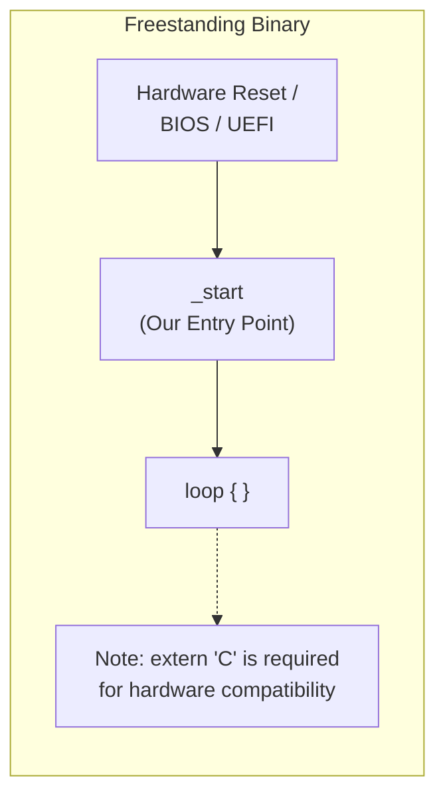

# boot-me-maybe-os

## The `_start` Entry Point

In a typical Rust binary running on an OS (like Linux or Windows), execution starts at `_start` (provided by the C runtime crt0), which sets up the stack, initializes the standard library, and *then* calls your `main()` function.

In our freestanding binary (bare metal), we don't have an OS or C runtime. We must define our own `_start` function, which is the very first thing the hardware runs after reset (or the bootloader jumps to).

