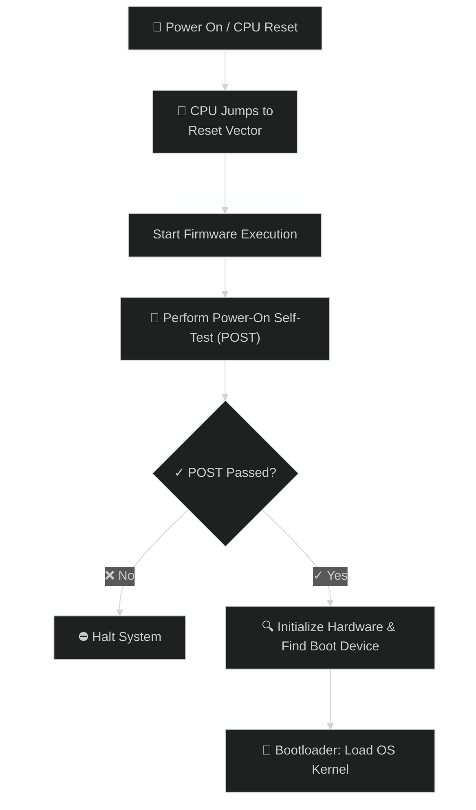

# BootMeMaybe: An Operating System in Rust

BootMeMaybe is a hobby operating system developed from scratch in Rust. Building an OS requires breaking away from the familiar environment provided by standard operating systems, and tackling challenges at the bare-metal level.

This project is documented in a detailed blog series. Check out the first post:
[BootMeMaybe: An Operating System in Rust](http://prabhavdogra.github.io/blog/boot-me-maybe-os-in-rust)

## Core Concepts

To run directly on hardware without an underlying OS, this project implements several fundamental concepts:

### 1. A Freestanding Environment

Standard Rust relies on the `std` library, which depends on an OS for features like threading, memory allocation, and file I/O. BootMeMaybe disables the standard library (`#![no_std]`) to operate in a freestanding environment, where we must define our own entry points, panic behaviors, and memory management.

### 2. The Boot Process

When a computer powers on, it executes a series of steps to transition from hardware initialization to running an operating system. 

```mermaid
%%{init: {'flowchart': {'htmlLabels': true}, 'theme': 'dark'}}%%
flowchart TD
    A["🔌 Power On / CPU Reset"] --> B["💾 CPU Jumps to<br/>Reset Vector"]
    
    subgraph FW["🧠 Firmware (BIOS / UEFI)"]
        direction TB
        C["Start Firmware Execution"]
        D["🧪 Perform Power-On Self-Test (POST)"]
        E{"✓ POST Passed?"}
        F["⛔ Halt System"]
        G["🔍 Initialize Hardware & Find Boot Device"]
    end
    
    B --> C
    C --> D
    D --> E
    E -->|❌ No| F
    E -->|✓ Yes| G
    G --> H["🚀 Bootloader: Load OS Kernel"]
    
    style FW fill:none,stroke:#ffffff,stroke-width:2px,stroke-dasharray: 5 5
```

### 3. The Bootloader

The bootloader is the crucial bridge between the system firmware (like BIOS or UEFI) and the OS Kernel. BootMeMaybe uses a custom bootloader tailored for a 64-bit Rust kernel, gaining full control over the early boot process. This approach avoids the limitations and complexities of standard options like GRUB and Multiboot.

The bootloader's main responsibilities include:
*   Loading the kernel image into memory.
*   Transitioning the CPU through its operating modes: from the legacy 16-bit **Real Mode**, through the isolated 32-bit **Protected Mode**, and finally into the modern 64-bit **Long Mode** that enables a massive virtual address space and advanced memory protection.

## References & Further Reading

- [BootMeMaybe: An Operating System in Rust (Blog Post)](http://prabhavdogra.github.io/blog/boot-me-maybe-os-in-rust)
- [Writing an OS in Rust (Philipp Oppermann)](https://os.phil-opp.com/)
- [A Freestanding Rust Binary](https://os.phil-opp.com/freestanding-rust-binary/)